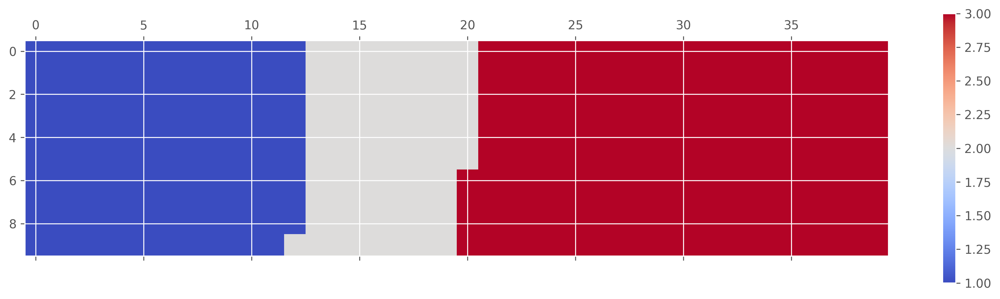
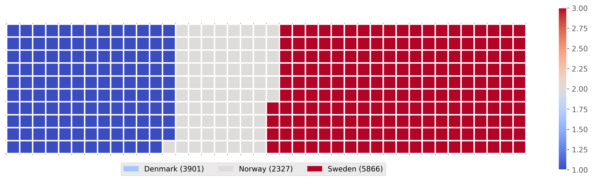
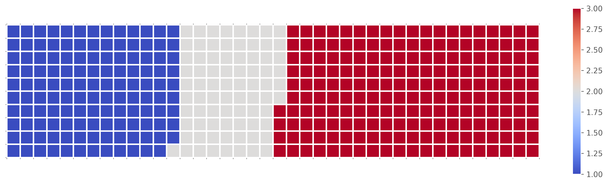

# waffle-charts-and-pywaffle
experimenting with waffle and pywaffle charts
# 📊 Waffle Chart Visualization using Python

This project demonstrates how to create a **Waffle Chart visualization** using Python to represent categorical proportions in a visually intuitive grid format. The chart is built using **Matplotlib, Pandas, and NumPy**, and visualizes immigration data for selected countries.

---

## 📌 Project Overview

A waffle chart is a grid-based visualization where each tile represents a proportion of the total. This project:

- Loads immigration data into a Pandas DataFrame
- Filters data for specific countries (Denmark, Norway, Sweden)
- Calculates proportional representation
- Converts proportions into tiles
- Displays a waffle chart using Matplotlib

This visualization makes it easier to compare categorical values visually.

---

## 🛠️ Technologies Used

- Python 3.x  
- Pandas  
- NumPy  
- Matplotlib  
- Jupyter Notebook  

---

## 📂 Dataset

The dataset contains immigration data to Canada by country.

Source: IBM Developer Skills Network dataset

---

## 📸 Output

### Waffle Chart Visualization

This waffle chart represents the proportional immigration totals for Denmark, Norway, and Sweden.

---

### Waffle Chart with Legend

This version includes clear color-coded legends for better interpretation.

---

### Waffle Chart with Grid Structure

This version highlights the grid structure used to construct the waffle chart.

---

### PyWaffle Style Visualization

Alternative waffle chart created using PyWaffle-style visualization.

